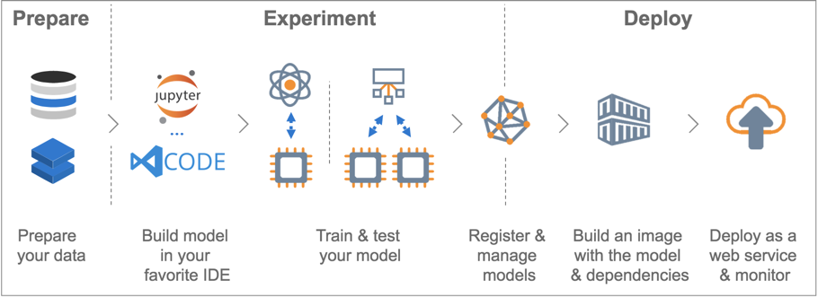

## Train and deploy Unet on Keras model using Azure Machine Learning Service

### Introduction

In the folder of [unet+watershed_research_code](../unet+watershed_research_code/cell_extraction.md), we described the solution of extracting cell from chemical or biological microscope images. This folder will show how to leverage Azure Machine Learning Service Python SDK to train, and deploy Unet on Keras model in Azure Container Instance.

### Azure Machine Learning Service

[Azure Machine Learning Service](https://docs.microsoft.com/en-us/azure/machine-learning/service/) is a cloud service that you use to train, deploy, automate, and manage machine learning models, all at the broad scale that the cloud provides. Besides portal UI, it also provides Python SDK to improve productivity.

### Code description

The data and Unet python script we used for training is from [github](https://github.com/zhixuhao/unet), actually sample dataset is from a [ISBI challenge](http://brainiac2.mit.edu/isbi_challenge/). The script including *trainUnet.py*, *data.py*, *model.py* are in aml_script folder.

In score script, to enable batch prediction, we accept the input of Azure Storage Container url where stores all the test images, and save the prediction images to another container (you should config its location in the *score.py* file), then return the result container url. So you can download them from the container to local computer. If single input is needed, code in score file must be changed.
