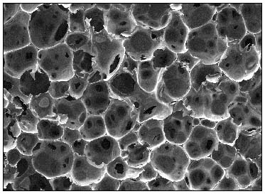

# Cell extraction in chemical or biological microscope image

## Introduction

In chemistry or biology industry, scientists always use microscope to study the structure of some biological tissue or materials. They also need to seperate the cell from the complete structure, so that they can get the count of the cell and also the centroid and the area of the cell, to check the quality and metric of the tissue or materials. Microscope images are like below, left is polyurethane material and right is cell.

 

This repo is to use [Unet deep learning network](https://en.wikipedia.org/wiki/U-Net) and [Watershed](https://en.wikipedia.org/wiki/Watershed_(image_processing)) to extract the edges of the cells and segment them from the microscope images, and also get the centroid and area of each cell. 

## Procedure

Take polyurethane microscope image as an example. At first, we used Watershed directly to segment each cell and get its centroid. But the result is not as expected because some cells has the irregular shape and unclear edge. We had to adjust the parameter manually image by image, which is not repeatable work. So we tried to investigate some deep learning algorithm to automatically extract the edge.

We decided to use Unet to extract the edge of the cell because of a similar scenario: [ISBI Neural Electron Microscope Image Segmentation challenge](http://brainiac2.mit.edu/isbi_challenge/home). A [github sample](https://github.com/zhixuhao/unet) tried to use UNET to extract the edge of neural electron and got very good accuracy after little training steps. The ISBI challenge is as below:

So the final step is 
1) transform the original image to contrast gray image
2) Manually label several typical images as black and white edge image
3) train the whole UNET model, or with transfer learning 
4) transform the edge extraction result to binary image
5) Use Watershed to extract all the cells from the edge result and get centroid and area information

For labeling the edge image, we tried two approaches:
1) Use [Labelme](https://github.com/wkentaro/labelme) to label the cell by polygon and generate the black and white edge image based on the json file, with white color inside cell and black color filled the edge.
2) Use default Painting app to draw the edge manually.

## code description
Use UNET implementation from the [github sample from zhixuhao]((https://github.com/zhixuhao/unet)), upload the image folder to */data* folder with a train folder and a test folder, each folder will cover a image folder and a label folder, each includes the .png file named from 0.

The data is used for transfer learning based on a pre-trained Unet model ( like *unet_membrane.hdf5* ). You can leverage the Azure Machine Learning script in the folder of [azureml_script](../azureml_script/aml_devops.md)  to train the model and download it.

Last step, use Skimage implemented Watershed algorithm to extract each cell and get its centroid and area.

